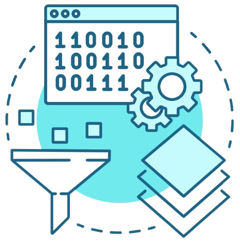

# About me

Hi there! I'm a engineering student from France, currently working at [Télécom Physique Strasbourg](https://www.telecom-physique.fr/). 

## Who am I ?

I'm a 22 years old student, currently in my last year of engineering school. I'm passionate about operating systems, IoT and security.

## What do I do ?

I worked on a number of [computer projects](https://github.com/EthanAndreas?tab=repositories) in the last few years, but the most important ones are the creation of a [compiler](/projects/sos2mips), the development of a lightweight IP-based communication between field devices for [Siemens company](https://www.siemens.com/de/de/unternehmen/standorte/niederlassung-karlsruhe.html) or the study and addition of features on [xv6](https://github.com/EthanAndreas/xv6-os) operating system.

## What do I like?

I'm passionate about oceans and surfing, my goals are to focus my professional path around this passion. I would like to work on the development of new technologies to help the ocean and the environment in general.

<!--  -->
